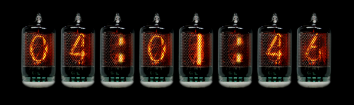
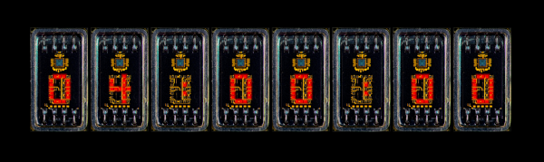
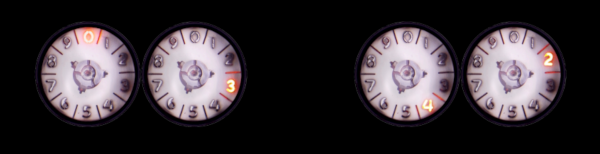
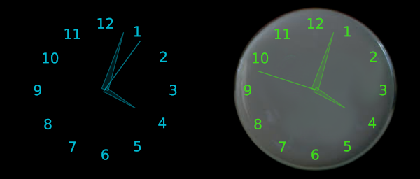
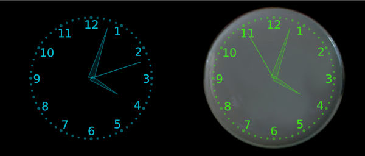
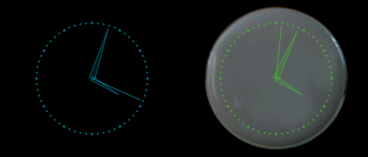
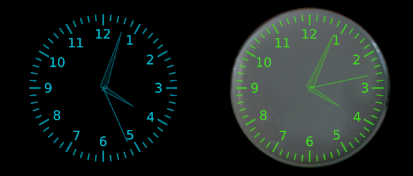
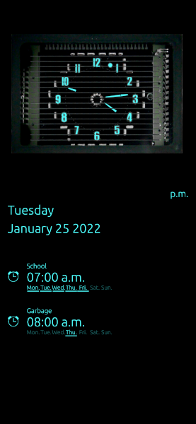

-----------------------


**Turn your Ubuntu Touch device into a retro clock with a large collection of cold war era display technologies.**

## Release
----------
**The images and an installable click file will be released once there is 
an official way of getting a click reviewed that does not require 
installing a program to then join a social group to ask for review.**

## License
----------

### Application Code
The code in this repository is under the [Simplified BSD license](https://opensource.org/licenses/BSD-2-Clause)


### Images
All of the custom artwork will be in a separate repository under a Creative Commons [Attribution Non-Commercial Share-Alike license](https://creativecommons.org/licenses/by-nc-sa/4.0/)


## Credits
----------
The code is based on [Night Clock by Michal Predotka](https://open-store.io/app/nightclock.mivoligo).

All reference photos used to make the displays are used under fair use 
and are highly transformed from the originals. I have spent countless 
hours dissecting the images into individual parts, scaling, tweaking the 
colors and deforming them to produce perfectly aligned configurable images.
Many of the displays are based on a single image as they are rare or 
even one of one. None of the reference pictures are used in their original form.

Reference photos were found on these wonderful collectors sites and forums:

* [SwissNixie](https://www.swissnixie.com)
* [DecadeCounter](http://www.decadecounter.com/vta/)
* [IndustrialAlchemy](https://www.industrialalchemy.org)
* [TubeClockDB](https://www.tubeclockdb.com)
* [TubeTester](http://www.tube-tester.com)
* [Spark-Tube](https://www.spark-tube.com)
* [Jogis-Roehrenbude](http://www.jogis-roehrenbude.de)
* [Nixies.us](https://www.nixies.us)
* [TubeTime](http://tubetime.us)

If you think I have used your reference photos during the creation of my 
work, and I have not included your site, please open an issue and let me 
know, so I can add it. Some reference photos were found on social media 
posts without reference to their origin.

## Notes
--------
* Possible future changes
    * Make analog clock and date/alarms display side by side in landscape.
    * Backgrounds and overlays to complete the look of real world clocks.
    * Slot machine and shuffle transitions like used on real nixie clocks.
    * Display date in numerical format using smaller versions of the display chosen.
    * Hue/Saturation wheel or panel instead of Hue and Saturation sliders for custom colors.
    * Use as lock screen.
    * Use on/as wallpaper.
    * Timer and stopwatch mode.
    * Option to force landscape mode while the phone is in portrait. (Does not look to be possible with a setting, only in the .desktop file)

* It was tested on two devices during development
    * Oneplus 6T ( 64bit )
    * Oneplus One ( 32bit )

* The program could be optimized and cleaned up, but I have very little 
experience with declarative or object-oriented programming, and before this 
program I had never used Qml, QT or Java. I have left all redundant 
code and even added to it. 

* The presets are saved in a C type array and the colors are all saved in 
individual variables with get and set functions, since I did not know how 
to do it in QML and the colors could not be used after being re-saved 
in the C type array.

* The program is much larger than Night-Clock due to the 432 custom png 
images included. I have tried to keep it as small as possible by reducing 
the png resolution without sacrificing quality on a phone.

* All of the displays below are based on real world display technology 
from the cold war era, except the colon tubes which are fictional and 
generally do not exist in the real world.

* Most of the L.E.D. displays are from the very early days of L.E.Ds and 
are not the most useful, but none the less interesting.

* The decade counter clocks are for the tube clock lovers among you, not 
because they are good clocks.

## Options
----------
There are 8 fully customizable presets that can have all their parameters 
changed individually, except the time/date formats and fullscreen which 
are global.

* Select Display type
* Adjust Hue of "Tube Clocks"
* Set Background Color (HSV or RGB)
* Set Foreground Color of Text, Analog Clocks and L.E.D. displays (HSV or RGB)
* Custom Preset names
* HSV or RGB color selection
* Show Seconds
    * Blink colons (with show seconds)
* Show Date
* Show Alarms
* ScreenSaver Mode (Moves digital clock every minute)
* Hide Oscilloscope background to show just the face and hands
* Time Format
    * 12hr with leading zero
    * 12hr without leading zero
    * 24hr with leading zero
    * 24hr without leading zero
* Date Format
    * 9 standard formats
* Fullscreen or Windowed

## Displays
------------
* Tube Clocks
    * 10 types of Nixie tubes and Neon panel displays. (Adjustable Hue)
    * 1 type of Electroluminescent segmented cyrillic font display panel. (Adjustable Hue)
    * 3 types of Vacuum Fluorescent segmented displays. (Adjustable Hue)
    * 1 type of Cathode Ray Tube display. (+1 variation) (Adjustable Hue)
    * 1 type of Thyratron segmented display. (Adjustable Hue)
    * 2 types of Decade counters. (+1 variation) (Adjustable Hue)
    
* L.E.D. & Flip Clocks
    * 5 types of segmented and dot matrix L.E.D. displays. (Color matches Text color)
    * 2 colors of Flip clock.

* Analog Clocks
    * 2 types of Vacuum Fluorescent Analog clocks. (Color matches Text color)
    * 5 types of Oscilloscope clock faces. (Color matches Text color)
    * 5 types of clocks. (same faces as oscilloscope) (Color matches Text color)

------------------------

**All pictures show the colors of the actual real life displays.**

 The colors are customizable in the settings menu.

### B7971 15 Segment Nixie Tubes


### GN1 Nixie Tubes


### ZM1010 Nixie Tubes


### CD66A Nixie Tubes


### IN23 11 Segment Nixie Tubes


### MG17G 7 Segment Neon Tubes


### NEO8000 7 Segment Neon Displays


### NEO5000 7 Segment Neon Displays


### ZM1350 15 Segment Neon Displays


### IEL0VI 8 Segment Electroluminescent Displays


### Y1938 Prototype 7 Segment Vacuum Fluorescent Tubes


### DG10B 9 Segment Vacuum Fluorescent Tubes


### IV6 7 Segment Vacuum Fluorescent Tubes


### XM1000 Nimo Cathode Ray Tubes


### XM1000 Nimo Cathode Ray Tubes


### ITS1A 7 Segment Thyratron Tubes


### HP5802-7002 Prototype 5X7 L.E.D. Matrix Displays


### HP5802-7000 1970 L.E.D. Matrix Displays (5X7 matrix with holes, only 27 pixels)


### HP5802-7000 1987 L.E.D. Matrix Displays (5X7 matrix with holes, only 27 pixels)


### TIA8447 7(14) Segment L.E.D. Displays


### HDSP0960 20 Pixel 7 Segment Style L.E.D. Displays


### E1T Beam Deflector Decade Counter Tubes


### ZM1050 Pixie Style Decade Counter Tubes


### Black Flip Clock Faces


### White Flip Clock Faces


### FIP60B30T Vacuum Fluorescent Analog Clock


### VFD48 Vacuum Fluorescent Analog Clock


### Custom Oscilloscope and Floating Analog Clock Faces

#### Type A


#### Type B


#### Type C


#### Type D


#### Type E


### Screenshots
---------------

#### Vertical Orientation


#### Horizontal Orientation without seconds


#### Horizontal Orientation without leading zero


#### Horizontal Orientation with leading zero and seconds


#### Nixie Tube Hue examples


#### Settings


### Building from source
------------------------
Install [Clickable](https://clickable-ut.dev/en/latest/)

Download or clone the Retro-Clock repo

See the #Release section for information on the release of the images.  
<s>Download the [img](https://github.com/Intrinsically-Sublime/rc-images) 
folder and place it in the root of Retro-Clock along side the qml and po folders.</s>

Open a terminal at the root of Retro-Clock and run ``` clickable ``` or ``` clickable desktop ``` or ``` clickable build ```

----------

Copyright (c) 2-22, [Intrinsically-Sublime](https://github.com/Intrinsically-Sublime)
All rights reserved.
